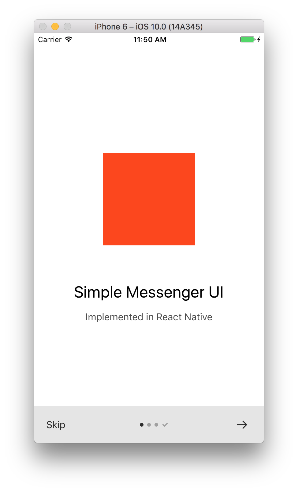
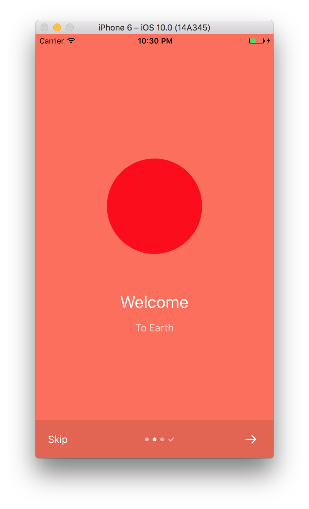
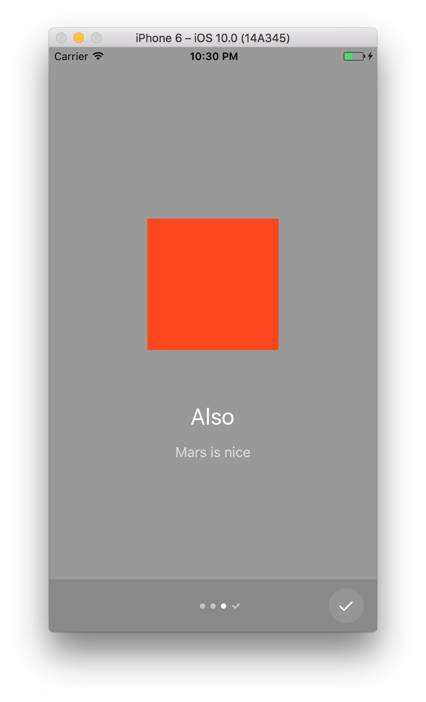

# `<Onboarding />`

[](https://badge.fury.io/js/react-native-app-onboarding)
[](https://travis-ci.org/noentiger/react-native-app-onboarding)
[](https://www.npmjs.org/package/react-native-app-onboarding)

Onboarding experience made a breeze.

Originally inspired by [React Native Simple Onboarding](https://github.com/goshakkk/react-native-simple-onboarding).

## Quick demo

|  |  |  |
| --- | --- | --- |
| Adapts to bright backgrounds | and dark, too | shows the Done button |

```javascript
<Onboarding
  pages={[
    { backgroundColor: '#fff', image: <Square />, title: 'Simple Messenger UI', subtitle: 'Implemented in React Native' },
    { backgroundImage: 'http://example.com/image.png', title: 'Simple Messenger UI', subtitle: 'Implemented in React Native' },
    { backgroundColor: "#fe6e58", image: <Circle />, title: 'Welcome', subtitle: 'To Earth' },
    { backgroundColor: "#999", image: <Square />, title: 'Also', subtitle: 'Mars is nice' },
  ]}
  onEnd={}
/>
```

## Install

```
npm install --save react-native-app-onboarding
```

```javascript
import Onboarding from 'react-native-app-onboarding';
```

## Usage

## `<Onboarding />` component

Props:

* `pages` (required): an array of onboarding pages. A page is an object of shape:
  * `backgroundColor`: a background color for the page
  * `backgroundImage`: a background image for the page
  * `image`: a component instance displayed at the top of the page
  * `title`: a string title
  * `subtitle`: a string subtitle
* `onEnd` (optional): a callback that is fired after the onboarding is complete
* `bottomOverlay` (optional): a bool flag indicating whether the bottom bar overlay should be shown. Defaults to `true`.
* `showSkip` (optional): a bool flag indicating whether the Skip button should be show. Defaults to `true`.
* `showNext` (optional): a bool flag indicating whether the Next arrow button should be show. Defaults to `true`.
* `showDone` (optional): a bool flag indicating whether the Done checkmark button should be show. Defaults to `true`.

## To Do

* animations
* accessibility

## License

MIT.
